# Deeplearning.ai course 4

Additional Resources:
Refer to [cs231n](https://cs231n.github.io/convolutional-networks/#conv). It is probably the best course on computer vision.
This course was also great and helped me to fill a lot of knowledge gaps. Andrew is a very good teacher.

## Convolutional Neural Networks

Some use cases of Computer vision are -

- Image Classification
- Object Detection
- Neural Style Transfer

Potential Challenges

- Large images —> large input and large matrices
    - Millions and billions of parameters

**Here come  the convolution layers instead of the fully connected layers. (fcc)**

### Edge Detection

Edge detection is possible using kernels or filters. A filter is something that takes an input image, processes it and gives some output.  This image explains what a filter does (Cs 231N)

- Run the filter over the image one by one (stride = 1, refer below) and do the **element wise multiplication and addition of the resulting values of**  the overlapping 
regions.
- The resulting numbers are the new pixel values which capture the brightness of the surrounding 
pixels.

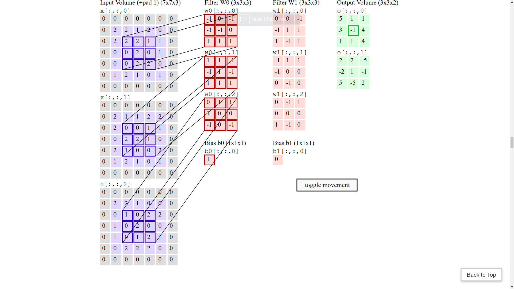

Convolution operation

If you want to understand even more deeply, check [this](https://www.youtube.com/watch?v=C_zFhWdM4ic) video by ComputerPhile.
Code examples

```
tf.nn.conv2d - Tensorflow
keras - conv2d
```

- There are vertical, horizontal filters and various other type of filters like Scharr filter, Sobel filter.


- Instead of hand coding the different values of the filter, we treat the filter values
to be learnable weights. The filter can then learn these through backpropagation
- This allows the neural net to detect very complex edges as well like curves, 45, 70 degree
angled edges etc.

### Padding

- If a matrix nxn is convolved with fxf  filter/kernel give us n-f+1,n-f+1 matrix.
- The convolution operation shrinks the image if f > 1
- Another downside is that the pixels near the edges are not used as much as pixels
somewhere in the middle. So, we are throwing away a lot of information near the 
edges + we will end up with a very small image if a deep neural network.

**How to avoid shrinking?**

- Pad the image with zeros (add P additional borders) before applying convolution.

### Valid and same convolution

**Valid** - no padding

**Same** - pad so that the output size is same as the input size

If n = 6, f = 3, and p = 1 Then the output image will have n+2p-f+1 = 6+2-3+1 = 6. We maintain the size of the image.

- `P = (f-1) / 2` will ensure that input size = output size
- In computer vision f is usually odd. Some of the reasons is that its have a center value and 
allows asymmetric padding.

### Strided Convolutions

Stride refers to the amount of movement done by our kernel. 

- stride `S` tells us the number of pixels we will jump when are convolving filter. If
we jump only 1 step, then S = 1

N x N matrix and F x F filter

```
Output size : (N + 2P - F)/S + 1 for how many neurons will fit.
```

- If not an integer, take floor.

**Cross-correlation vs. convolution**

In deep learning literature, the we do not do the flipping operation.
In ML literature, it is called convolution instead of cross-correlation.

### Convolution over volumes

- Suppose we have RGB image, which has 3 channels i.e three stacked matrices.
- We will need the same amount of filters stacked together to perform the convolution operation.
- These will attack together. Suppose we have 6 x 6 x 3 matrix, our filter is 3 x 3 x 3, 
then it will perform 27 multiplications and add them, slide and repeat.
- Note that the output image has only one channel.

**Whats the Importance of this, huh?**

- We can use multiple filters. We can let a few filters perform horizontal edge detection, others do 
vertical edge detection and then stack them together.
- Alternatively, it is possible to detect individual color filters by choosing the filters accordingly.

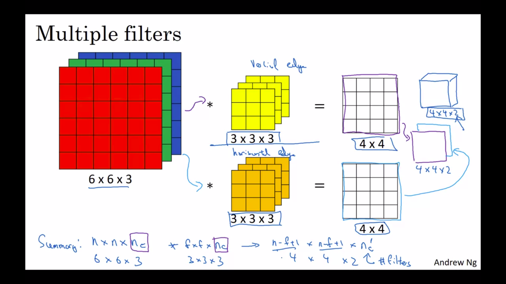

## One convolution Layer

This screenshot summarizes it perfectly.

**Whats going on?**

- Input = Image
- Apply the convolution operation(output: 4x4) + b (4x4). The resultant matrix is similar
to "w[1]a[0]" + b1"
- Apply activation function (Relu) and you get the output image. Stack it.


**The magic of this technique**

**No matter the size of the input, the number of the parameters is same if filter size is same. That makes it less prone to overfitting. Thats some amazing stuff!!**

## Notation


## A simple convolution neural network

Andrew shows us an example of a very simple CNN where we only use successive convolution 
operations to downsample the image and then applying an activation function or non-linearity.

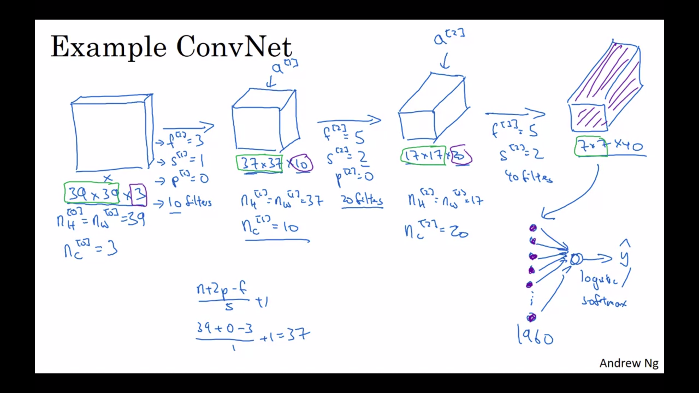

Whole process can be seen. Notice the Height and Width decreasing and channels increasing.

**Whats really happening?** 

The height and width of the image keeps decreasing gradually
while the depth/channels of the image increases as we use more filters.

It turns out that we use three kinds of layers in a CNN

- Convolution layer
- Pooling Layer
- Fully connected Layer

## Pooling layer

**How is pooling done?**

We decide on a size f for the pooling layer.

- We run f x f regions over the image similar to how we run the filters in convolution
- Now, we take the **max valued pixel in that region**

**Why pooling layers are used?**

CNNs often uses pooling layers to reduce the size of the inputs, speed up computation, and to make some of the features it detects more robust.

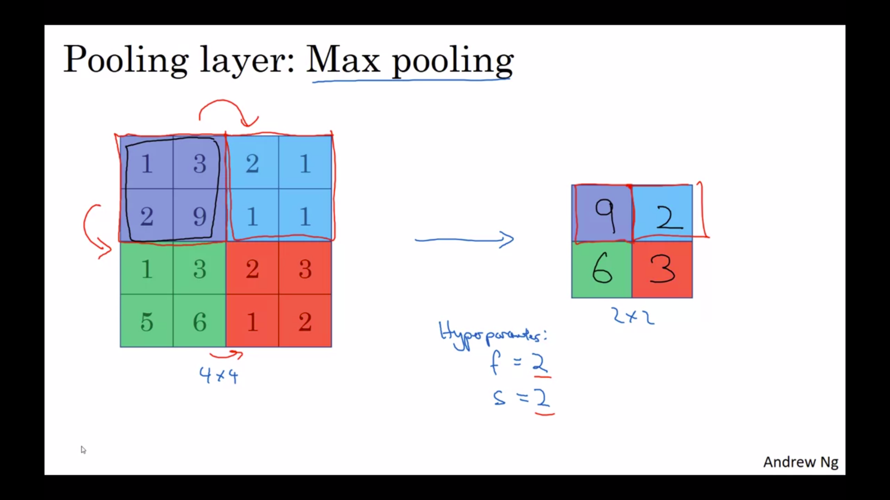

This example has f = 2, s = 2, and p = 0 hyperparameters

### Intuition behind pooling

- Keep the max number of the feature if it is appearing
- Most people use it for faster computation and the reasons are not really clear

### Other points to note

- **Average pooling is taking the averages of the values instead of taking the max values.**
- Max pooling is used more often than average pooling in practice.
- If stride of pooling equals the size, it will then apply the effect of shrinking.

### Hyperparameters summary

f : filter size.

s : stride.

Padding are rarely uses here.

Max or average pooling.

**Pooling layer don't have parameters to learn**

## CNN Example inspired by LeNet-5(Yann Le Cunn)

Andrew refers to (Conv + Pool) as one layer.


### Whats happening in the above example?

- What we see above is a common type of CNN example where
Convolution operation followed by pooling are applied multiples times.
- Then, at the end we have some fully connected layers(the normal neural network style layers)

**CONV → POOL → CONV → POOL → FC → FC → FC**

### Some more details about parameters

- Notice the pooling layer has no parameters
- Activation size gradually drops. If activation size drops quickly, thats not a good network.

    

    Some errors in the image- 

    1. 208 should be (5*5*3 + 1) * 8 = 608

    2. 416 should be (5*5*8 + 1) * 16 = 3216

    3. In the FC3, 48001 should be 400*120 + 120 = 48120, since the bias should have 120 parameters, not 1

    4. Similarly, in the FC4, 10081 should be 120*84 + 84 (not 1) = 10164

    (Here, the bias is for the fully connected layer. In fully connected layers, there will be one bias for each neuron, so the bias become In FC3 there were 120 neurons so 120 biases.)

    5. Finally, in the softmax, 841 should be 84*10 + 10 = 850

- Finally ,we are down to 10 outputs(MNIST had 10 classes)
- Usually the input size decreases over layers while the number of filters increases.

## Why convolutions are so useful?

Two main advantages of Convs are:

- Parameter sharing.
    - A feature detector (such as a vertical edge detector) that's useful in one part of the image is probably useful in another part of the image.
- sparsity of connections.
    - In each layer, each output value depends only on a small number of inputs which makes it translation invariance

## Week 2  Case Studies

### Why look at case studies?

A lot of research has been done on how to put the different layers together.

- Good way to gain intution by seeing other ConvNets. This is similar to learning to write code
by reading others code.
- A CNN architecture that works on some other case can work on your problem as well
- To learn to read research papers. Understand.

We are going to look at 

- LeNet
- AlexNet
- VGG Net
- Resnet (152 layers) won ImageNet competition
- Inception (GoogleNet)

Andrew says that these ideas will help to work in other fields as well.

### Classic Networks

### LeNet - MNIST digits


- This model was published in 1998. The last layer wasn't using softmax back then.
- It has 60k parameters.
- The dimensions of the image decreases as the number of channels increases.
- `Conv ==> Pool ==> Conv ==> Pool ==> FC ==> FC ==> softmax` this type of arrangement is quite common.
- The activation function used in the paper was Sigmoid and Tanh. The modern implementation uses RELU in most of the cases.
- [[LeCun et al., 1998. Gradient-based learning applied to document recognition]](http://ieeexplore.ieee.org/document/726791/?reload=true)

**Advanced notes**

- The computers were slow so they had some workaround for filters
- They used non-linearity after pooling layers.
- This is a harder paper to read. Look at section 2 and section 3 if you read.

## AlexNet

- Named after Alex Krizhevsky who was the first author of this paper. The other authors includes Geoffrey Hinton.


### Notable features

- Bigger than LeNet-5
- Had 60 million parameters > 60k parameters of LeNet
- Used **RELU**
- The original paper contains Multiple GPUs and Local Response normalization (RN).
    - Multiple GPUs were used because the GPUs were not so fast back then.
    - Researchers proved that Local Response normalization doesn't help much so for now don't bother yourself for understanding or implementing it.
- This paper convinced the computer vision researchers that deep learning is so important.
- [[Krizhevsky et al., 2012. ImageNet classification with deep convolutional neural networks]](https://papers.nips.cc/paper/4824-imagenet-classification-with-deep-convolutional-neural-networks.pdf)

**Andrew suggests that if you want to start reading papers, then this one is a good to start.**

## VGG - 16

It really simplified the neural net architecture

Focus on having only these blocks:

- CONV = 3 X 3 filter, s = 1, same
- MAX-POOL = 2 X 2 , s = 2


### Notable features

- Large by normal standards - 138 million parameters
- Simplicity made it appealing
- 16 refers to the fact it has 16 layers that have weights
- Number of filters increases from 64 to 128 to 256 to 512. 512 was made twice.

Main downside: Really large network

- Another bigger version —> VGG -19 but people use VGG-16 because it performs roughly same.
- VGG paper is attractive it tries to make some rules regarding using CNNs.

[[Simonyan & Zisserman 2015. Very deep convolutional networks for large-scale image recognition]](https://arxiv.org/abs/1409.1556)

### What Andrew liked

- The relative uniformity attracted the researchers

The pattern of as you go deeper, height and width goes down by factor of 2 and pooling layers increase. Very systematic.

Andrew Ng recommends —> AlexNet —> VGG —> LeNet paper

## Resnets

### Context

Deep neural nets are really hard to train. By theory, a deeper neural network should perform better as we go deeper but in reality, this does not happen(As with a lot of things in physics, xD)

- [Exploding gradients](https://www.youtube.com/watch?v=qhXZsFVxGKo), vanishing gradient problem is one of the reasons. (Gradients get very big or very small and get on the border of the actviation functions)


- Resnets avoid this problem using skip connections.


- The authors of this block find that you can train a deeper NNs using stacking this block.
- [[He et al., 2015. Deep residual networks for image recognition]](https://arxiv.org/abs/1512.03385)

Each block between the arrays is called a residual block.


### Why resnets works?

Here, suppose we are calculating **a [ l + 2 ],** 

- Now if we use l2 regularisation, it's likely that our **w [ l + 2] has shrinked a lot.** It might be the case that the weight and the bias parameter are close to zero.
- So, adding **a [ l ] helps** to learn the identity function better.


- Identity function is easier to learn for the residual blocks.

a [ l + 2 ] = g ( z [ l + 2 ] + a [ l ] )
            = g ( w [ l + 2] * a [ l + 1 ] + a [l ]
            = g ( 0 + 0 + a [l] )
            = g ( a[l] )
            = a[l]
So, it is same as g (output + input) = input

**Andrew emphasises on this. Here, he tries to convince that due to this property of learning the identity function (input = output —> identity matrix) is what makes it harmless to add more and more residual blocks.** 

### Additional details in resnet

- All the 3x3 Conv are same Convs.
- spatial size /2 => # filters x2
- No FC layers, No dropout is used.
- Two main types of blocks are used in a ResNet, depending mainly on whether the input/output dimensions are same or different. You are going to implement both of them.
- The dotted lines is the case when the dimensions are different. To solve then they down-sample the input by 2 and then pad zeros to match the two dimensions. There's another trick which is called bottleneck which we will explore later.
- They frequently use "Same" convolutions. This helps to ensure a[ l ] and z [ l + 2 ] have the same dimensions.
- A weight matrix can be multiplied with a[l] to make dimensions correct. Zero padding can 
also be used.

## Network in network concept

### **Whats the idea here?**

- Use 1 x 1 convolution with multiple filters to
    - Increase more non-linearity
    - Decrease the number of channels/depth or even increase
    - Save computation

Since, the convolution happens parallely for all the channels, the height and width remains same and the number of channels is equal to number of filters.

This idea was proposed in the paper [[Lin et al., 2013. Network in network]](https://arxiv.org/abs/1312.4400)


## Inception networks (GoogLeNet)


The researchers were inspired by the movie and even referenced the picture in the paper. Inception network creators - Lets use all the types of layers and make a big bad network!!!!!

### Inception motivation

The inception module uses the 1 x 1 convolution idea actively


The calculation for 5 x 5 filter yields 120 million computations(multiplications)

It helps to reduce the computations by a factor of 10 i.e 21 million e.g
In the above example, it helps to reduce the 

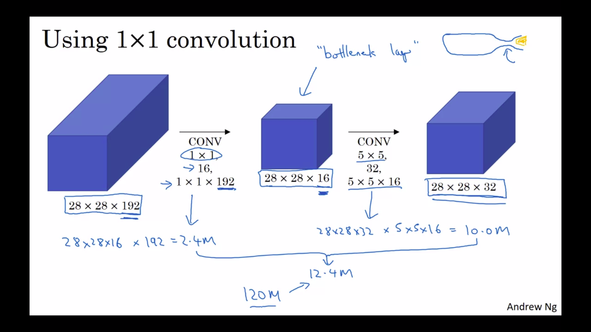

By the use of 1 x 1 convolutions, the creators cleverly reduce the computations.

- The reduced depth block here is called the "bottleneck layer".
- It turns out that this procedure does not cause any hurt in performance.

## Inception module


The inception module is used repeatedly in the inception network. So, if you understand this block, then you are good to go.
**Notable features**

- 1 x 1 convolutions
- Stacking of results of different kind of operations
- MaxPool with "same" padding to preserve the depth. Then, performing 1 x 1 conv to reduce depth.


Keras Inception module

**Additional advanced details**

- There are 3 Softmax branches at different positions to check the output of the intermediate layers. It helps to ensure that the intermediate features are good enough to the network to learn and it turns out that softmax0 and sofmax1 gives regularization effect.
- Since the development of the Inception module, the authors and the others have built another versions of this network. Like inception v2, v3, and v4. Also there is a network that has used the inception module and the ResNet together.

## Practical advice for ConvNets

### Using open-source implementations

- Andrew advices if you want to build over a research paper, search for an open-source implementation e.g on Github.
- Re-implementing from scratch can be very tricky sometimes. There are many minor details that are often not mentioned in the papers. or could be missed.
- To get going fast, it's better to search Open Source code of your desired framework and get going.
- Some advantage of doing this is that you might download the network implementation along with its parameters/weights. The author might have used multiple GPUs and spent some weeks to reach this result and its right in front of you after you download it.

### Transfer Learning

- If you are using a specific NN architecture that has been trained before, you can use this pretrained parameters/weights instead of random initialization to solve your problem.
- It can help you boost the performance of the NN.
- The pretrained models might have trained on a large datasets like ImageNet, Ms COCO, or pascal and took a lot of time to learn those parameters/weights with optimized hyperparameters. This can save you a lot of time.

**Ways to do transfer learning**

- Download the model i.e it's weights from an opensource implementation.
    - Now you have two options
    1. If you have a small dataset like the cat classfication problem of Tigger, Misty and Neither
    It is better to **freeze the layers of the network(we don't train these layers).
    Remove the softmax classifier and use your own softmax at the end.**
    2. If you have a large dataset, you can choose to freeze some layers in the beginning of the network and train the network. Or if you have a lot of data, you can treat the network as 
    **initialization** and just train the whole network with your own classifier at the end.
- One of the tricks that can speed up your training, is to run the pretrained NN without final softmax layer and get an **intermediate representation of your images and save them to disk**. And then use these representation to a shallow NN network. This can save you the time needed to run an image through all the layers. This helps to avoid recalculating activations again and again.
    - Its like converting your images into vectors.
- **Throw away some layers** and add some of your own layers

### Data augmentation

- Computer vision is a complicated task and it requires a complicated function to do this.

**More data always helps in Computer Vision.** 

Common data augmentation techniques

- Mirroring operation —> It helps to preserve the picture and add a bit of data
- Take random crops —> helps learning more orientations
- Rotation, shearing, local warping less used
- **Color shifting - change RGB values slightly**

    Color shifting - e.g add 20 to r and b and subtract 20 from g. Different photos can have 
    different textures of sunlight. This approach mimics the same.

- PCA color optimisation (I don't know about this). There are an algorithm which is called PCA color augmentation that decides the shifts needed automatically.

- **Implementing distortions during training:**
    - You can use a different CPU thread to make you a distorted mini batches while you are training your NN. Images loaded with variations.
- Data Augmentation has also some hyperparameters. A good place to start is to find an open source data augmentation implementation and then use it or fine tune these hyperparameters.

### State of Computer Vision

- For more complicated tasks like object detection, it seems that even today, data available is less. For such tasks, more hand engineering is required.
- If we have a lot of data, it is simple to just get going with simpler algorithms and less hand engineering.

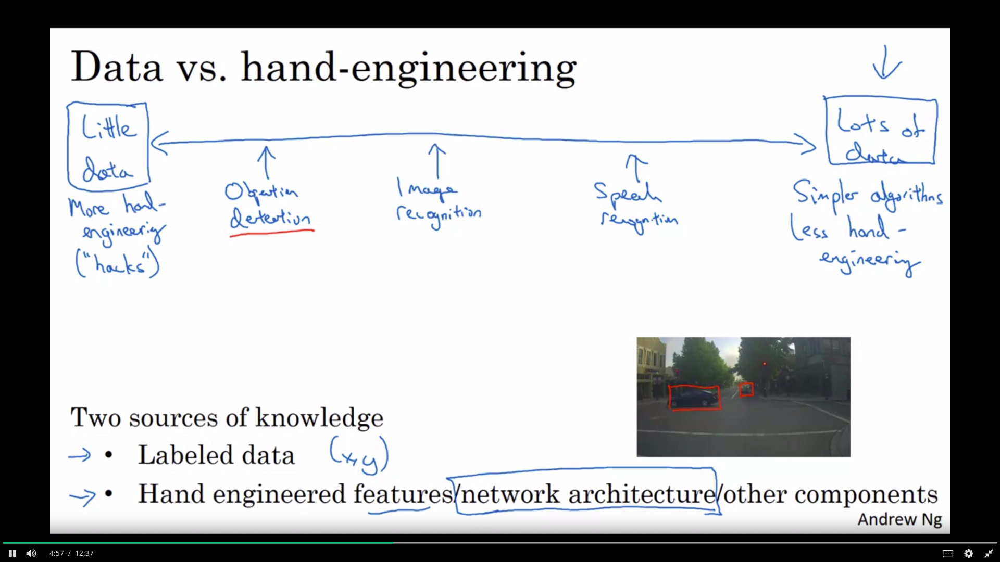

Hand engineering is a difficult task and needs a lot of skill and insight.

- In the recent era, hand engineering has reduced due to more data but still, there is enough hand engineering being done.
- **Transfer learning comes rescue when less data.**

### Tips for doing well on benchmarks/winning competitions:

- Ensembling.
    - Train several networks independently and average their outputs. Merging down some classifiers. **Do not average the weights.**
    - After you decide the best architecture for your problem, initialize some of that randomly and train them independently.
    - This can give you a push by 1-2%.
    - But this will slow down your production by the number of the ensembles. Also it takes more memory as it saves all the models in the memory.
    - People use this in competitions but rarely used for production.
- Multi-crop at test time.
    - Run classifier on multiple versions of test versions and average results.
    - There is a technique called 10 crops that uses this.
    - This can give you a better result in the production
    - This consumes less memory as compared to ensembling.

### Use open source code

- Use architectures of networks published in the literature
    - There are lot of finnicky details that they have already handled
- Use open source implementations if possible.
- Use pretrained models and fine-tune on your dataset.
- Don't refrain from training your network if you have enough resources.

# Week 3 Detection Algorithms

## Object Localization

Object detection is a field in computer vision that has exploded in the last few years.

- Classification and classification with localization generally have 1 object but detection
may have many objects.
- Localization needs to make bound about the object.

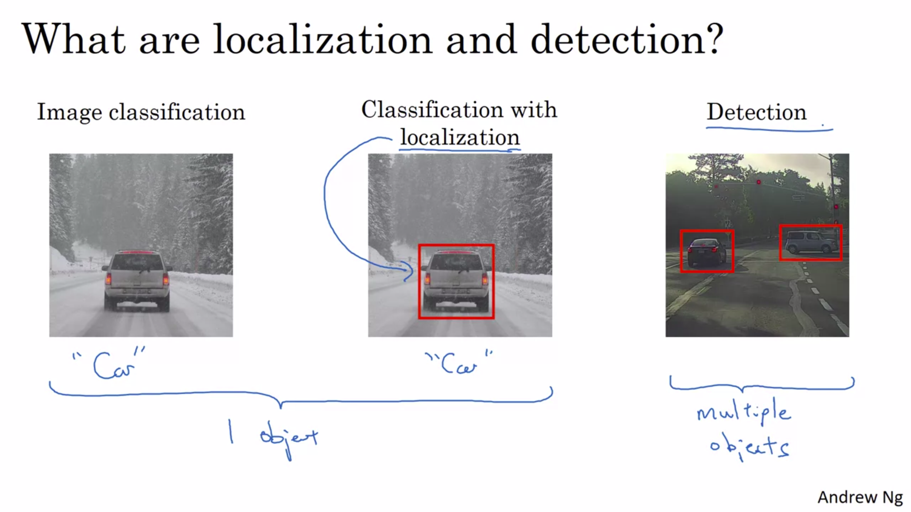

### Object detection example from CS231n


- To make image classification we use a Conv Net with a Softmax attached to the end of it.
- To make classification with localization we use a Conv Net with a softmax attached to the end of it and a four numbers `**bx`, `by`, `bh`  `bw`** to tell you the location of the class in the image. The dataset should contain this four numbers with the class too.
- Defining the target label Y in classification with localization problem:

                                           [  Pc  ]

                                           [  Bx  ]

                                           [  By  ]

                                           [  Bh ]

                                           [ Bw  ]

                                      [  c1  ]

                                     [  c2  ]

                                     [ c3  ]

**If Pc = 1 then only we have the other entries. Otherwise, we don't care about them.**

The loss function for the Y we have created (Example of the square error):

- `L(y',y) = {	(y1'-y1)^2 + (y2'-y2)^2 + ... if y1 = 1`
- `(y1'-y1)^2	if y1 = 0	}`
- In practice we use logistic regression for `pc`, log likely hood loss for classes, and squared error for the bounding box.

### Landmark detection

- Other than the bounding box coordinates, we can sometimes want the neural nets 
to output some more important points
- Suppose we want to do face detection, we can decide on some points across the eyes, mouth and the jawline as Andrew shows in the video.

    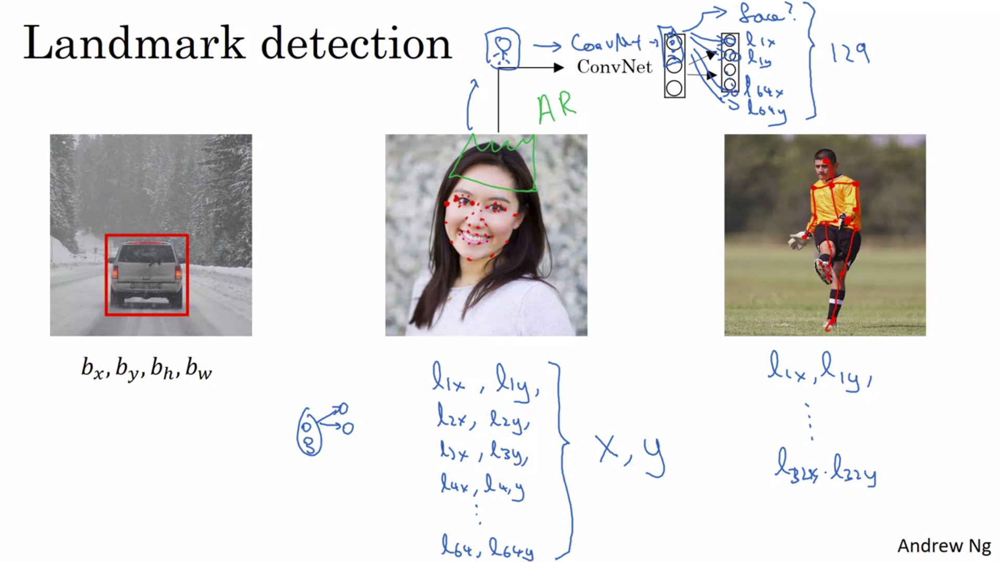

- Another application is when you need to get the skeleton of the person using different landmarks/points in the person which helps in some applications.
- **The landmark points need to be consistent across the data i.e the labels have to 
be same across all images.** e.g For an eye, you would like to consider a few points on the left of left eye and right of right eyes. These need to be consistent.

Some examples


The above image is taken from an OpenCv [page](https://docs.opencv.org/master/d2/d42/tutorial_face_landmark_detection_in_an_image.html).

### Object Detection

- **Sliding window detection**


- Choose a window and run the image inside the window through the ConvNet.
- Keep increasing the sliding windows in iterations.
- The hope is that the car will be captured in some window and classified eventually.
- Using a coarse stride will affect results and using too fine will be computationally expensive.

Sliding window is really computationally expensive for ConvNets(earlier, less expensive methods were used).

**What did the deep learning people do for this?**

Lets find out.

### Convolution Implementation of Sliding Windows

This involves converting the fully connected layers into convolutional layers.

- Turning FC layer into convolutional layers (predict image class from four classes):


- As you can see in the above image, we turned the FC layer into a Conv layer using a convolution with the width and height of the filter is the same as the width and height of the input.
- **Basically, convolve with filters having the same height and width.**

**Working**


In the example taken by Andrew

- We have a test image 16 x 16 x 3 (Added yellow stride).
- In sliding window, we would have generated windows with some stride like say 2. Then, we would have made 4 subsets of the image and pass them through the Convnet.
- But it is clear that a lot of duplication work is being done here as regions between almost all the four subsets are common.

how to do convolution implementation?

- Allow the forward pass to share a lot of computation
- Take the convnet with the same parameters, structure as we had before.
In the end, we are left with 2 x 2 x 4.
- It turns out that the upper left region gives us the result of the upper right of the original image i.e the first sliding window of the normal implementation.
- For upper right region gives result for upper right of original image and so on.

Running on a bigger image. We get a slightly bigger output.


- This example has a total of 16 sliding windows that share the computation together.
- Thus, we can make all the predictions in a one single pass through a big ConvNet.
- The weakness of the algorithm is that the position of the rectangle wont be so accurate. Maybe none of the rectangles is exactly on the object you want to recognize.

[[Sermanet et al., 2014, OverFeat: Integrated recognition, localization and detection using convolutional networks]](https://arxiv.org/abs/1312.6229)

### Bounding box predictions

- The sliding window does not guarantee a good bounding box prediction.
- YOLO stands for you only look once and was developed back in 2015.


1. Suppose have an image of 100 X 100
2. We pace a 3 x 3 grid on the image the 100 x 100. For better results, prefer higher N x N grid e.g 19 x  19
3. We apply the classification and localization algorithm discussed in a previous section to each section of the grid. `bx` and `by` will represent the center point of the object in each grid and will be relative to the box so the range is between 0 and 1 while `bh` and `bw` will represent the height and width of the object which can be greater than 1.0 but still a floating point value.
4. Do everything at once with the convolution sliding window. If Y shape is 1 x 8 as we discussed before then the output of the 100 x 100 image should be 3 x 3 x 8 which corresponds to 9 cell results.
5. Merging the results using **predicted localization mid point.**


- We are going to have 8 outputs for each grid. If Pc = 0, then we don't care about other values.

      C1, C2, C3 depict the classes. Hence output will be 3 x 3 x 8 volume.

- The bounding box co-ordinates are mentioned as ratios < 1.(More of percentage.)
They could be bigger than one if object goes beyond the grid.

### Advantages

- The algorithm does a convolutional implementation, hence it works very fast and is efficient.
- YOLO uses a single CNN network for both classification and localizing the object using bounding boxes.

Andrew finally says that the YOLO paper is one of the harder ones to read. Even high level researchers find it difficult to figure out.

### Intersection over Union

- Used for evaluating the object detection algorithm and add components later??
- Intersection area is the area between the bounding boxes. Union area is the total area bounded by both the boxes.

IOU = intersection area / Union area

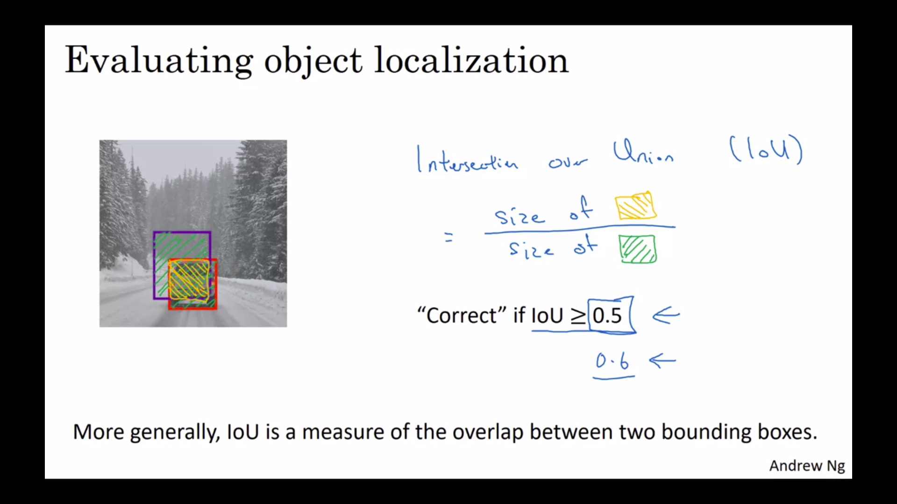

- If `IOU >=0.5` then its good. IOU ≤ 1. (0.5 is human chosen convention. You can be more strict with higher value)
- The higher the IOU the better is the accuracy.

### Non-Max Suppression

**Problem→**One of the problems with object detection algorithms is that the algorithm will 
detect the same object multiple times. Non-max suppression helps to tackle this problem i.e it makes sure that your algorithm detects the object **only once.**

**You detect only once in YOLO!!!!!**😝

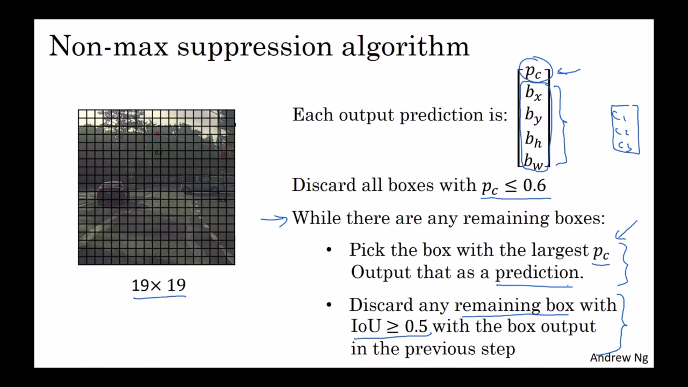

- The algorithm will output many boxes with lower probabilities also. The non-max suppression method will simply discard the boxes with lower prediction values and select the boxes with the max suppression value. Sort of being greedy.
- **Note: We will have to apply this for each different classes separately.**

### Anchor Boxes

**In YOLO, a grid only detects one object. What if a grid cell wants to detect multiple object?**

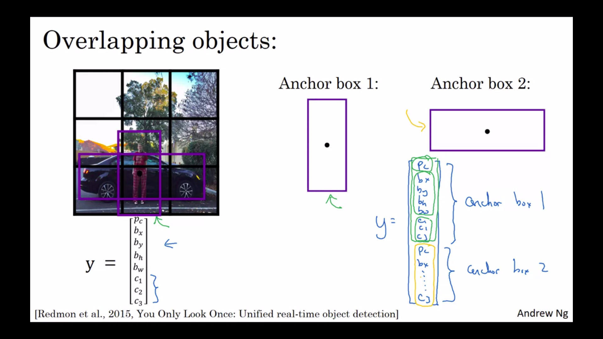

- With two anchor boxes, Each object in training image is assigned to grid cell that contains object's midpoint and anchor box for the grid cell with highest IoU. We have to check where your object should be based on its rectangle closest to which anchor box.
- Our output dimension will change. In the above 3 x 3 x 16 or 3 x 3 x 8 x 2

How to decide the boxes?

- You can select 5-10 boxes depending on your needs. e.g you can choose wide boxes for objects like cars or other wide objects and choose boxes accordingly for tall, thin objects etc.
- Another way is to use k - means algorithm on your dataset to specify.

Final points

- Two objects overlapping, crossing each other is an uncommon thing with coarse grids like 19x19.
- Andrew says that the even better advantage the algorithm gives is the fact it allows the algorithm to specialise more. e.g Some output units will specialise on certain shapes.

### YOLO algorithm Summary

- Yolo is a **SOTA object detection model.**

Suppose we have three classes to train

- Car
- Motorcycle
- Pedestrian

And we have 2 anchor boxes, then y is 3 x 3 x 2 x 8

- Most of the grid cells have nothing in them.
- We first initialize all of them to zeros and ?, then for each label and rectangle choose its closest grid point then the shape to fill it and then the best anchor point based on the IOU. so that the shape of Y for one image should be `[HeightOfGrid, WidthOfGrid,16]`
- We train the labeled images on a Conv net. we should receive an output of `[gridHeight, gridWidth,16]` for our case.
- To make predictions, run the Conv net on an image and run **Non-max suppression** algorithm for each class you have in our case there are 3 classes.
    - Run the IOU filtering to get rid of excess boxes
    - Run the non-max suppression
- And just hope that everything goes well.......

### Region Proposal

- The older RCNN papers proposed some 2000 regions based found by signal processing methods.
Later, these regions were proposed by using segmentation and then the classifier was used
on the **blobs.** Thus, this helped to save computations but it was still slow

    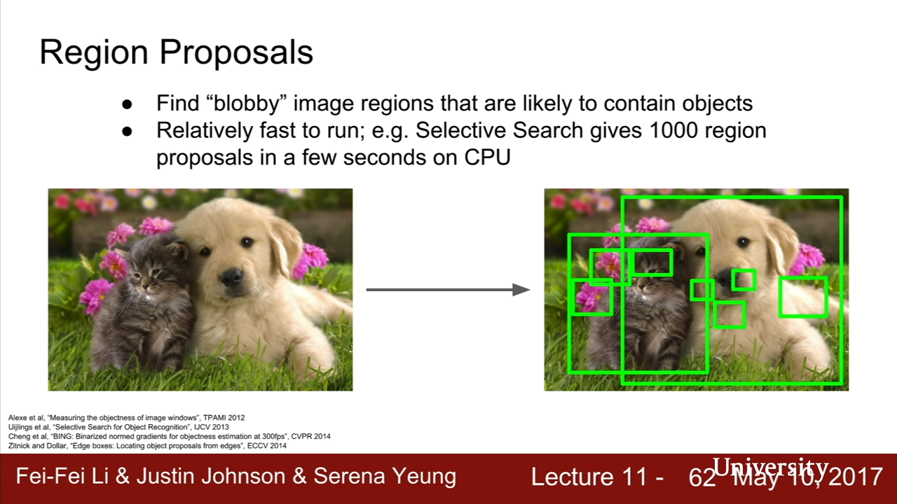

- R-CNN algorithm later was implemented using full convolutional implementation.

    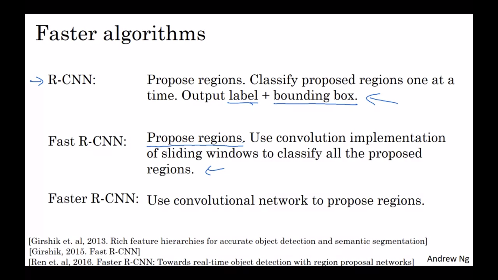

    ## Week 4

    ### Face Recognition

    - Face recognition system can identify persons both in image/video.

    **Liveness detection**

    within a video face recognition system prevents the network from identifying a face in an image. It can be learned by supervised deep learning using a dataset for live human and in-live human and sequence learning.

    **Face verification vs. face recognition**:

    - Verification:
        - Input: image, name/ID. (1 : 1)
        - Output: whether the input image is that of the claimed person.
        - "is this the claimed person?"
    - Recognition:
        - Has a database of K persons
        - Get an input image
        - Output ID if the image is any of the K persons (or not recognized)
        - "who is this person?

    **Major challenge in face recognition**

    - We need to solve the **One-shot learning problem.** It means that we are going to have
    only one image of the person to recognise him/her.

    ### One shot Learning

    - We need to have a dataset where we have atleast a few images for each person 
    e.g 10k images for 1k persons.

    **How does one shot learning work?**

    - The network learns a "similarity function"
    - We want **d(img1, img2) to be small than a certain threshold to verify as same.**

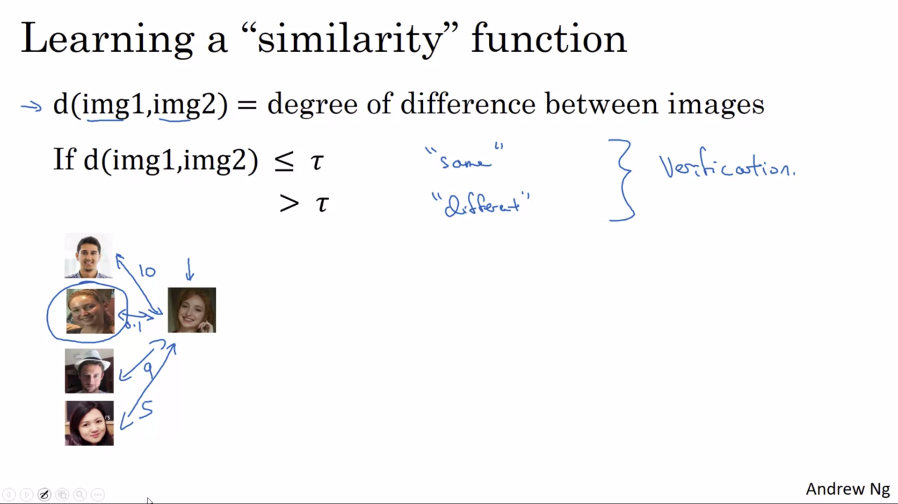

- Thus, the similarity function helps us to solve the one-shot learning problem.

**The Siamese Network**

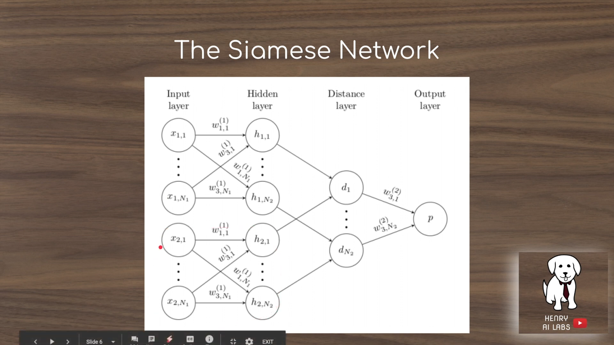

Check the video by Henry Ai labs [here.](https://www.youtube.com/watch?v=T9yKyZfxUJg)

- The similarity function d inputs two images and tells how different or same the images are.
- A good way is to use a siamese network. We can input a picture to a CNN and then, we input another picture to the same net with the same parameters. At the end of forward prop,
we get a **Feature vector**(In Andrew's example, it is 128 sized)
    - We call this the encoding f(x(1)) for that image.
    - Generalizing, if x[i]( ith training example) and x[j] are the same person, then the norm should be small.
    - Otherwise if they are different person. The network then learns to mimic these conditions using backpropagation.

    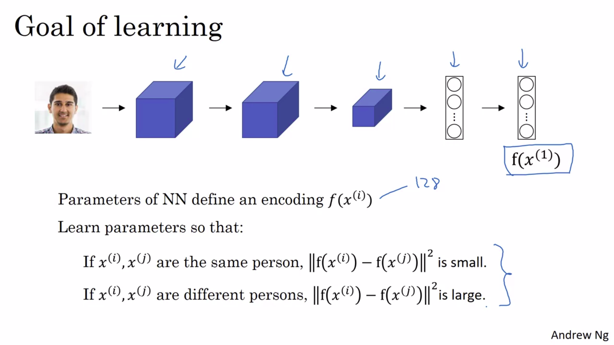

    DeepFace paper can be seen [here](https://www.cv-foundation.org/openaccess/content_cvpr_2014/html/Taigman_DeepFace_Closing_the_2014_CVPR_paper.html).

    ### Triplet loss function

    - Triplet loss function is used to calculate the similarity distance.
        - We have an **anchor image, positive image (same person) and a negative image (different person).** Hence the name triplet.


The above screenshot sums up it nicely. 

- We want the || f(A) - f(P) ||  - || f(A) - f(N)|| to be less than zero.
- To prevent our NN from outputing zeros, we add a parameter alpha to keep the RHS
less than zero. But we show it by adding on the RHS.

**Final Loss function**

- Given 3 images (A, P, N)
- `L(A, P, N) = max (||f(A) - f(P)||^2 - ||f(A) - f(N)||^2 + alpha , 0)`
- `J = Sum(L(A[i], P[i], N[i]) , i)` for all triplets of images.

**Other details**

- Choose triplets (A, P, N) that are "hard" to train on. The learning algorithm will try to push and pull the quantities. This helps to train more efficiently. (Similar to deliberate practice )

Large companies have large datasets of millions of images. 

One can use pretrained weights for their work.

### Face verification and binary classification

- This is another way to do face recognition by introducing a logistic regression unit at 
the end and just classify. (Alternative to triplet loss)

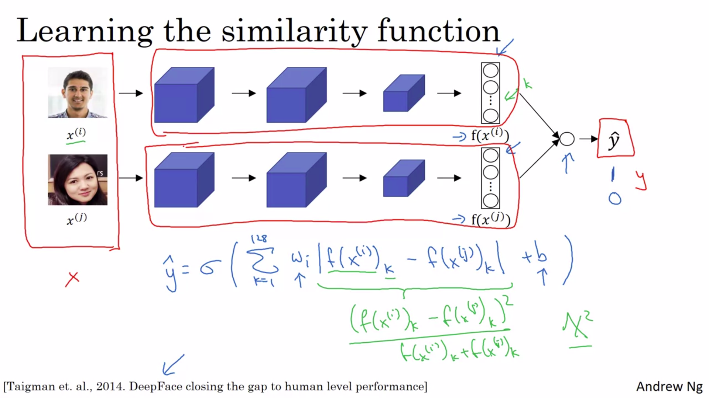

- We take the sum of abs(difference) between the encodings. We treat these as features.
Multiply by weights and add bias and feed into the logistic regression unit.
- Another way is to use the chi-square similarity formula.

**Deployment trick(Precomputation)**

- Pre-compute all the images that you are using as a comparison to the vector f(x(j))
- When a new image that needs to be compared, get its vector f(x(i)) then put it with all the pre computed vectors and pass it to the sigmoid function.

Treating as binary classification problem works equally well as the triplet loss function.

**Please refer the assignment for more technical details and references to papers.**

### Neural Style transfer

**What is neural style transfer?**

We copy the style of one image to the content of another image. This can be done using intermediate of neural networks


### What are the deep convNets learning?

- Andrew shows us example of the activations in the intermediate layers of neural nets.

Pick a unit in layer l. Find the nine image patches that maximize the unit's activation.

- Notice that a hidden unit in layer one will see relatively small portion of NN, so if you plotted it it will match a small image in the shallower layers while it will get larger image in deeper layers.
- It turns out that the earlier layers learn more about the lower level/ simple  features of the images like color, textures etc.

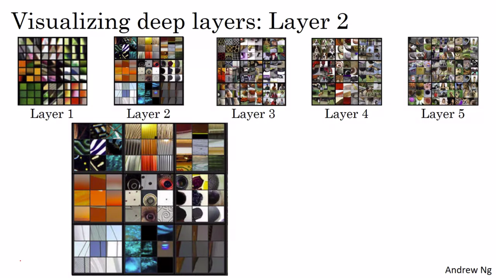

### Cost Function

- We define a cost function that computes how good is the image that we are generating.

Give a content image C, a style image S, and a generated image G:

- `J(G) = alpha * J(C,G) + beta * J(S,G)`
- `J(C, G)` measures how similar is the generated image to the Content image.
- `J(S, G)` measures how similar is the generated image to the Style image.
- alpha and beta are relative weighting to the similarity and these are hyperparameters.

    ### Content cost function

    

    - Alpha and beta are hyper-parameters chosen by the authors of the paper.
    - We use a pretrained ConvNet like VGG network. Grab the activations on the images.
    - J(C, G) at a layer l = 1/2 || a(c)[l] - a(G)[l] ||^2  (Actually, sum of square of pairwise difference or the square of the L2 norm)
    On performing gradient descent, it will incentivise the algorithm to make the images look similar.

    **Note: For more technical details, refer the jupyter notebook in week4/style_transfer**

    ### What is style?

    - Style is defined as the correlation across the activations across different channels.

    

    - Correlated means if a value appeared in a specific channel a specific value will appear too (depends on each other).
    - Uncorrelated means if a value appeared in a specific channel doesn't mean that another value will appear (Not depend on each other)

        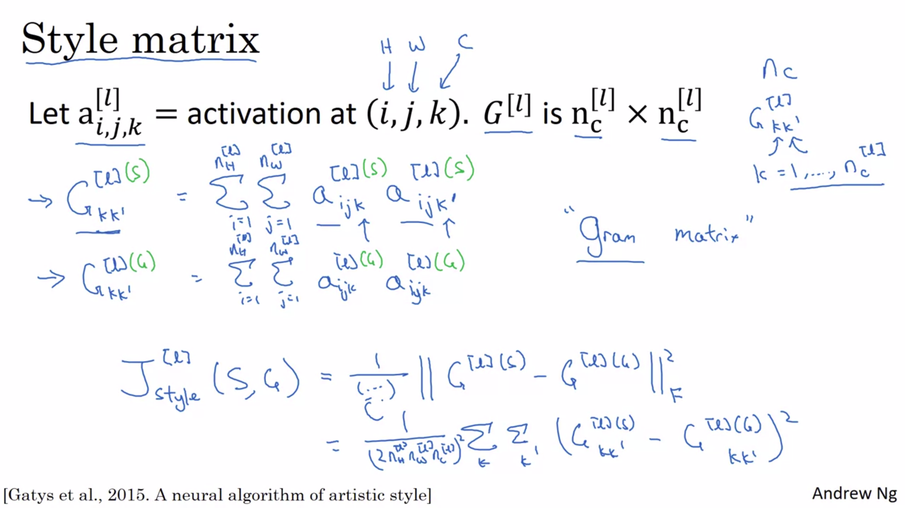

        - Gram matrix - It is the matrix of dot product of A * A.transpose. The style matrix is also known as the gram matrix. Note that it is **a square matrix of shape (n_C, n_C)**
        - G[ l ] kk where k ranges from [1,no. of channels]

        I have included the code-block from the jupyter notebook

        ```
        def compute_layer_style_cost(a_S, a_G):
            """
            Arguments:
            a_S -- tensor of dimension (1, n_H, n_W, n_C), hidden layer activations representing style of the image S 
            a_G -- tensor of dimension (1, n_H, n_W, n_C), hidden layer activations representing style of the image G
            
            Returns: 
            J_style_layer -- tensor representing a scalar value, style cost defined above by equation (2)
            """
            
            ### START CODE HERE ###
            # Retrieve dimensions from a_G (≈1 line)
            m, n_H, n_W, n_C = a_G.get_shape().as_list()
            
            # Reshape the images to have them of shape (n_C, n_H*n_W) (≈2 lines)
            a_S = tf.reshape(a_S,[-1, n_C])
            a_G = tf.reshape(a_G,[-1, n_C])

            # Computing gram_matrices for both images S and G (≈2 lines)
            GS = gram_matrix(a_S)
            GG = gram_matrix(a_G)

            # Computing the loss (≈1 line)
            J_style_layer = 1/(4*(n_H*n_W*n_H*n_W)*(n_C**2))* (tf.reduce_sum(tf.square(tf.subtract(GS,GG))))
            
            ### END CODE HERE ###
            
            return J_style_layer
        ```

        **tf.reduce_sum does the double summation i.e sum across all the axis.**

        ### 1D and 3D convolutions

        - The ideas we have learnt till now can be applied on 1d as well as 3d data.

        Andrew gives the example of time series like data (ECG graph). Here, we use 1d filter
        and apply it at lots of positions (like a sliding window ??). This rather gives a vector instead of 2d matrix.

        Other 1d data examples : sound signals, waves etc.

        ### 3D application

        - CT scan

        The image has height, width and depth of the input scan.

        Andrew works through an example:

        - Input shape (14, 14,14, 1)
        - Applying 16 filters with F = 5 , S = 1
        - Output shape (10, 10, 10, 16)
        - Applying 32 filters with F = 5, S = 1
        - Output shape will be (6, 6, 6, 32)
